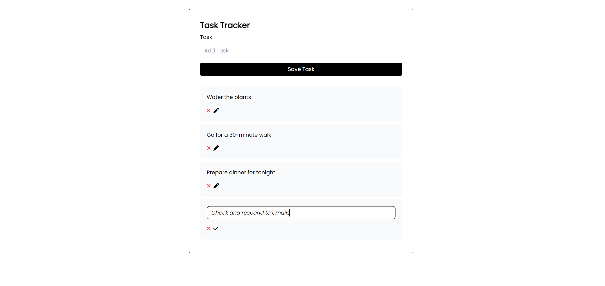

## Task Manager Application

The Task Manager application is a **Vue.js** and **Vuex-based application** that helps you track and manage your tasks. To run the application locally, follow the steps below:

### Approach

The Task Manager application was developed using the Vue.js framework and Vuex for state management. The application follows a component-based architecture, with each component responsible for a specific part of the UI. Vuex is used to manage the application's state, and local storage integration ensures persistent data storage. UUID is used for task identification to ensure unique identifiers for each task. The application is styled using Tailwind CSS, providing a flexible and responsive UI.

### Prerequisites

Before running the application, make sure you have the following software installed on your machine:

- Node.js (version 12 or above)
- npm (Node Package Manager)

### Installation

To install the required dependencies, navigate to the root directory of the Task Manager application in your terminal or command prompt, and run the following command:

`npm install`

This command will read the package.json file and install all the necessary packages and dependencies required by the application.

### Running the Application

To run the Task Manager application, follow these steps:

**Start the development server:**

`npm run serve`

This command will start the server and provide you with a local URL (e.g., `http://localhost:8080`) where you can access the application in your web browser.

### Using the Task Tracker Application

Once the application is running, you can use the Task Tracker to manage your tasks. Here's a brief overview of the application's functionality:

- **Adding a Task**: Use the "Add Task" input field to enter a task and press Enter or click the "Save Task" button to add it to the list.

- **Editing a Task:** Click the pen icon next to a task to enter edit mode. Modify the task text and press Enter or click the "correct" icon to save the changes

- **Deleting a Task**: Click the cross icon next to a task to delete it from the list.

- **Viewing Tasks**: The main section of the application displays all the tasks you've added. Tasks are shown in a list format, and completed tasks are highlighted with a green border.

### Code Structure

- src/
  - components/
    - HeaderComponent.vue
    - TasksComponent.vue
    - AddTask.vue
    - TaskComponent.vue
  - store/
    - modules/
      - tasks.js
    - index.js
  - App.vue
- main.js
- tailwind.css
- index.html

Here's an overview of how the code is structured and how the components interact with each other:

1. The **`App`** component is the main container for the application. It includes the **`HeaderComponent`**, **`AddTask`**, and **`TasksComponent`** components.
2. The **`HeaderComponent`** component displays a title in the header section of the application. The title is passed to the component as a prop.
3. The **`AddTask`** component is a form that allows users to add new tasks. It includes an input field for entering the task text and a submit button. When the form is submitted, the **`addTaskAndClearFields`** method is called, which generates a random ID for the new task using the **`uuid`** library, dispatches the **`addTask`** action from Vuex to add the task to the store, and clears the input field.
4. The **`TasksComponent`** component is responsible for rendering the list of tasks. It retrieves all tasks from the Vuex store using the **`allTasks`** computed property and iterates over them, rendering a **`TaskComponent`** for each task.
5. The **`TaskComponent`** component represents an individual task in the list. It displays the task text and provides buttons for deleting the task and editing the task text. The **`TaskComponent`** component has a **`task`** prop that receives the task object from the parent component (**`TasksComponent`**).
6. The Vuex store is divided into modules, and the **`tasks`** module is used for managing tasks. It includes state, getters, actions, and mutations for manipulating the task data. The state object contains an array of tasks. The actions perform tasks such as adding, deleting, and updating tasks by committing mutations. The mutations modify the state based on the actions.

### Additional Notes

- The Task Tracker application uses the Vue.js framework and Vuex for state management.

- The application loads tasks from local storage when it is created and saves tasks to local storage whenever there is a change.

- The application is styled using Tailwind.

- For task identification, the application uses UUID (Universally Unique Identifier) to generate random numbers, ensuring unique identifiers for each task. This helps in accurately tracking and managing tasks in the application.

- External packages like `vuex` and `vue` are used in the application. Make sure to install these packages and ensure that they compile correctly. If you encounter compilation errors, follow the steps mentioned in the "Compilation" section below.
